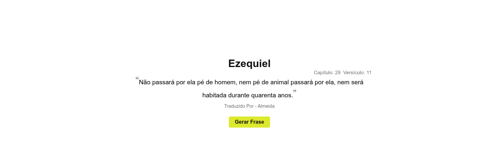

  
  
  

**Frases bíblicas** é um projeto que consome dados da API [bible-api](https://bible-api.com/data/almeida/random) onde a mesma gera frases aleatórias da Bíblia, os dados são traduzidos para português e exibidos em um site simples, sem qualquer uso de frameworks ou bibliotecas externas.

## Demonstração

  

## Tecnologias Utilizadas

Este projeto foi construído com as seguintes tecnologias:

- **[JavaScript](https://developer.mozilla.org/pt-BR/docs/Web/JavaScript)** - Linguagem de programação.
- **[CSS](https://developer.mozilla.org/pt-BR/docs/Web/CSS)** - Build tool e dev server de última geração.
- **[HTML5](https://developer.mozilla.org/pt-BR/docs/Web/HTML)** - Marcações web.

## Destaques

- **Código limpo:** O código é organizado e fácil de entender, seguindo boas práticas de desenvolvimento.
- **Design responsivo:** O layout é adaptável a diferentes tamanhos de tela, garantindo uma boa experiência em dispositivos móveis.
- **Uso de API:** O projeto consome dados de uma API externa, demonstrando habilidades de integração e manipulação de dados.
- **Async/await:** O projeto utiliza async/await para lidar com operações assíncronas, tornando o código mais legível e eficiente.
- **Try/Catch:** O projeto utiliza blocos try/catch para tratamento de erros, garantindo maior robustez e estabilidade.
- **Recarregamento:** Utiliza o evento de click para recarregar a página com `window.location.reload()`, permitindo que os usuários obtenham novas frases bíblicas de forma rápida e fácil.
- **Tradução de dados:** Os dados obtidos da API são traduzidos para português, proporcionando uma experiência mais acessível para os usuários que falam essa língua.
- **Sem frameworks ou bibliotecas externas:** O projeto é construído utilizando apenas tecnologias nativas, sem depender de frameworks ou bibliotecas externas, o que demonstra um bom domínio das tecnologias básicas da web.
